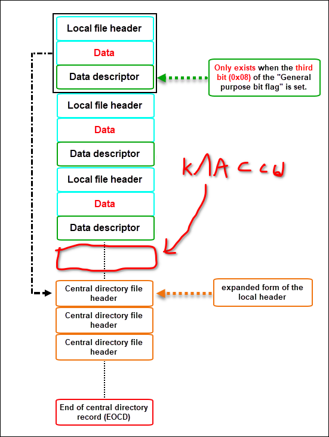

# Java 'obfuscator'

Код, который прячет один jar файл в другом.

Для сборки используйте ```build.sh```


Способ работы: классы помещаются между полями в zip файле.


Упаковщик - ```s9_loader/insert_payload.py```

Проект s9_loader содержит classloader, загружающий таким образом спрятанные классы из своего jar файла.
